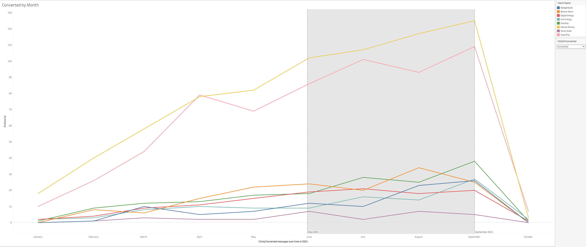

# Exploratory Data Analysis of Communications 

SQL is used to explore the data. The ```communications.sql``` and ```upload_communications.sh``` scripts were used to upload the data into SQL server which was running in a docker container. 

<br/>

## Data preparation
The data contained some missing information. I removed all tuples that contained *NULL* marks. This reduced the sample size to about 55% of the original. It's not much, but it reduces to the need to make assumptions about of the tuples. There are several ways to handle missing entries.

For numerical attributes like ```age```, I could have imputed the missing entries with a measure of central tendency like the **median**. Using a machine learning algorithm to predict missing values was also another option, but for simplicity, I just removed all the entries. For categorical variables like ```customer_country```, I think it'll be better to remove missing entries due to the importance of analysing our communication performance by country.

Here's the code I used to prepare the data for analyses. Luckily for me, I didn't have to clean much. A simple view of the data did the trick. The cleaned data was then exported for analysis with Tableau.

```sql
IF OBJECT_ID('clean_communications') IS NOT NULL  
  DROP VIEW clean_communications;
GO

CREATE VIEW clean_communications 
AS 
SELECT * 
FROM communications 
WHERE 
    [Message Id] IS NOT NULL AND
    [Customer Id] IS NOT NULL AND
    [Sent At] IS NOT NULL AND
    Clicked IS NOT NULL AND
    Converted IS NOT NULL AND
    [Client Id] IS NOT NULL AND
    Gender IS NOT NULL AND
    [Customer Country] IS NOT NULL AND
    Age IS NOT NULL AND
    [Created At] IS NOT NULL AND
    [Client Name] IS NOT NULL AND
    [Product Type] IS NOT NULL AND
    [Client Country] IS NOT NULL AND
    Channel IS NOT NULL AND
    [Message Number] IS NOT NULL
GO

-- Alter the date columns
ALTER TABLE communications ALTER COLUMN [Sent At] DATETIME2
ALTER TABLE communications ALTER COLUMN [Created At] DATETIME2
```

<br/>

## Questions
<br/>

I had a few questions about the dataset after scrutinizing it meticulously. So, the goal of this analyses is to answer the questions.

### Questions about the Messages
1. How many messages were sent in 2021?
```sql
SELECT COUNT([Message Id]) AS numOfMessages
FROM clean_communications;
```

After the cleaning data, I had 79562 messages.

<br/>

2. How many of these messages were clicked?
```sql
SELECT COUNT([Message Id]) as clicked 
FROM clean_communications
WHERE Clicked = 1;
```

5761 messages were clicked.

<br/>

3. How many were not clicked?
```sql
SELECT COUNT([Message Id]) as clicked 
FROM clean_communications
WHERE Clicked = 0;
```

73801 of the messages that were sent were not clicked. In this analyses, I'd like to focus on the attributes of the messages that were clicked. I'm doing this because I believe that if we can learn about the messages that were clicked, perhaps we can modify our communication habits accordingly. Nevertheless, it's important to learn about the messages that were not clicked.

<br/>

4. How many of the messages that were clicked lead to a conversation?
```sql
SELECT COUNT([Message Id]) as leadToConversataion
FROM clean_communications 
WHERE Clicked = 1 AND Converted = 1;
```

2,013 of the messages that were clicked lead to a conversation.

<br/>

5. What was the last message sent in 2021?
```sql
SELECT MAX([Sent At])
FROM clean_communications;
```

The last message was sent on October 1, 2021 based on the cleaned data.

<br/>


### Questions about our customers
1. How many customers do we have?
```sql
SELECT COUNT(DISTINCT[Customer Id]) as numOfCustomers
FROM clean_communications;
```
We have 5568 customers after cleaning the data.

<br/>

2. How many male and female customers do we have?
```sql
WITH unique_customers AS (
    SELECT DISTINCT [Customer Id], [Gender]
    FROM clean_communications
)
SELECT [Gender], COUNT(Gender) as total 
FROM unique_customers
GROUP BY [Gender]
ORDER BY total;
```

There are 2750 and 2818 males and females respectively.

<br/>

3. What gender are you more likely to have a conversation with in terms of their countries?
```sql
WITH unique_customers AS (
    SELECT DISTINCT [Customer Id], [Gender], [Customer Country]
    FROM clean_communications
    WHERE Clicked = 1 AND Converted = 1
)
SELECT [Customer Country], [Gender], COUNT(Gender) as total 
FROM unique_customers
GROUP BY [Gender], [Customer Country]
ORDER BY total;
```

<br/>

4. How old is our oldest customer?
```sql
DECLARE @maxAge FLOAT = (SELECT MAX(Age) FROM clean_communications);

SELECT DISTINCT Age as MaximumAge
FROM clean_communications
WHERE Age = @maxAge;
```

<br/>

Looks like we have a "very" senior citizen in our midst - aged 96.
<br/>

5. How young is our youngest customer?
```sql
DECLARE @minAge FLOAT = (SELECT MIN(Age) FROM clean_communications);

SELECT DISTINCT Age as MinimumAge
FROM clean_communications
WHERE Age = @minAge;
```

Our youngest customer is 18.

<br/>

6. Last but not least, what's the median age of our customers?
```sql
SELECT DISTINCT PERCENTILE_CONT(0.5) WITHIN GROUP (ORDER BY Age)
                            OVER (PARTITION BY rashid) AS MedianAge
FROM clean_communications;
```

The median age of our customers is 44.

<br/>


### Clients
1. Which of our clients had the most message clicks?
```sql
WITH clients AS (
    SELECT [Client Name]
    FROM clean_communications
    WHERE Clicked = 1
)
SELECT [Client Name], COUNT([Client Name]) as totalClicks
FROM clients
GROUP BY [Client Name]
ORDER BY totalClicks DESC;
```

Moose Money had the most clicks - 1586 clicks.

<br/>

2. What kind of products does this client produce?
```sql
WITH MooseMoney AS (
    SELECT [Client Name], [Product Type]
    FROM clean_communications
    WHERE [Client Name] = N'Moose Money'
)

SELECT DISTINCT [Product Type] 
FROM MooseMoney;
```

Moose Money are associated with a product type called "BNPL".

<br/><br/>


## Communications performance over time


Looks like most of customers click on the messages that we send within May and September. The same trend is observed with messages that lead to conversations. Over the years, I've noticed that many people like to have fun towards the end of the year. Some people seem to forget about the fact that they'll have bills to pay when the new year begins. Thus, it's not suprising that people do not respond to messages related to debts at the beginning of the year because they're probably out of money. They'll have to work a few months to make some many to pay off their debts. Similarly, towards the end of the year, people ignore debts because they'll need money to have fun.
